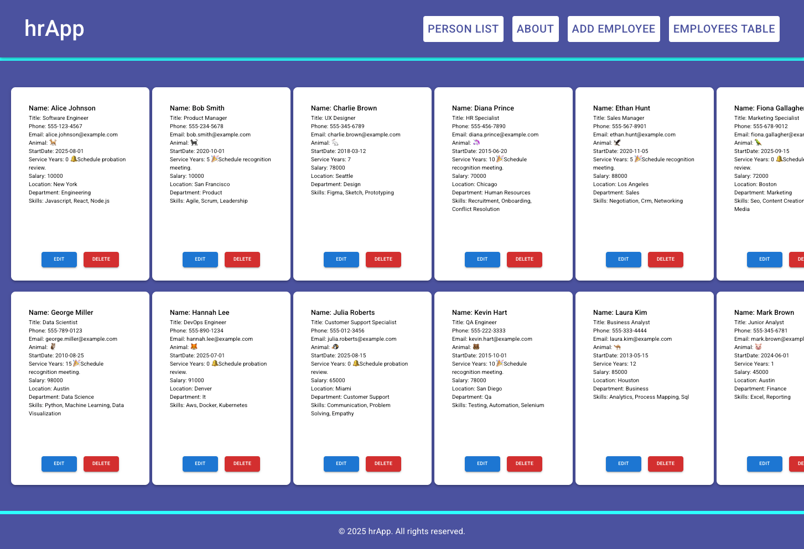
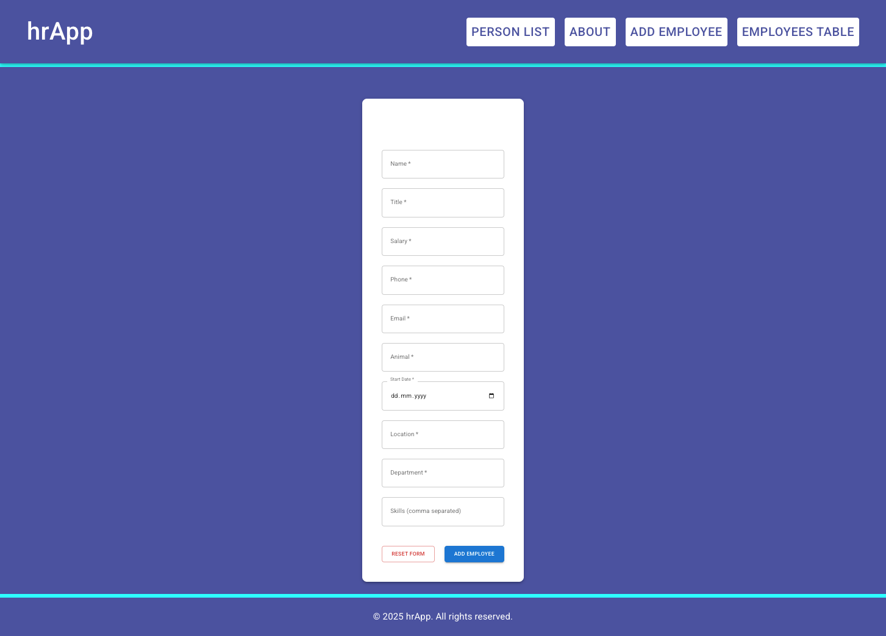
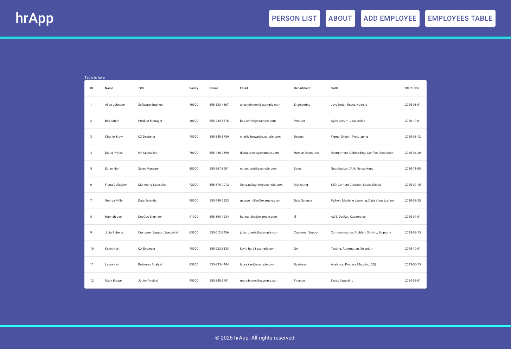

# HR App

🔗 **Live Demo:**

- GitHub Pages: [https://1967cooder.github.io/hrApp/#/](https://1967cooder.github.io/hrApp/#/)
- Local (Vite): [http://localhost:5173/hrApp/#/](http://localhost:5173/hrApp/#/)
- Mock API Live (Render): [https://hr-mock-api.onrender.com/]

---

## 📌 Project Description

**HR App** is a web application for managing employees (Human Resources). The app allows users to view, add, and manage employee data through a clean and user-friendly interface.

The project is built as a frontend application with a focus on:

- clean code structure
- modular components
- simple navigation
- responsive design
- separate HR Mock API hosted on Render for demonstration purposes

---

## ⚙️ Technologies Used

The project is built using the following technologies:

- **HTML5** – application structure
- **CSS3** – styling and layout
- **JavaScript (ES6+)** – application logic
- **React** – UI components
- **React Router** – client-side routing
- **Vite** – development environment and build tool
- **GitHub Pages** – application deployment

---

## ✨ Features

- 📋 Employee list display
- ➕ Add a new employee
- 🗑️ Delete employees
- 🔍 View employee details
- 🧭 Navigation without page reload
- 📱 Responsive design (desktop & mobile)

---

## 🚀 Run the Project Locally

1. Clone the repository:

```bash
git clone https://github.com/1967cooder/hrApp.git
```

2. Install dependencies:

```bash
npm install
```

3. Start the development server:

```bash
npm run dev
```

4. Open in your browser:

```
http://localhost:5173/hrApp/#/
```

---

## 📂 Project Structure (Basic)

```
hrApp/
│
├── src/
│   ├── components/
│   ├── pages/
│   ├── data/
│   ├── App.jsx
│   └── main.jsx
│
├── public/
├── package.json
└── README.md
```

---

🖼️ Screenshots

Below are screenshots showcasing the main parts of the application:

### 🏠 Home / Employee List



### ➕ Add Employee



### 👤 Employee Details



## 🎯 Project Goal

The goal of this project is to practice:

- building React components
- working with routing
- organizing a larger frontend project
- deploying applications to GitHub Pages

---

## 👤 Author

- **GitHub:** [https://github.com/1967cooder](https://github.com/1967cooder)

---

## Contacts

LinkedIn: https://www.linkedin.com/in/silvanalindholm

Email: silvanalindholm@hotmail.com

✅ This project is intended for educational and demonstration purposes.
